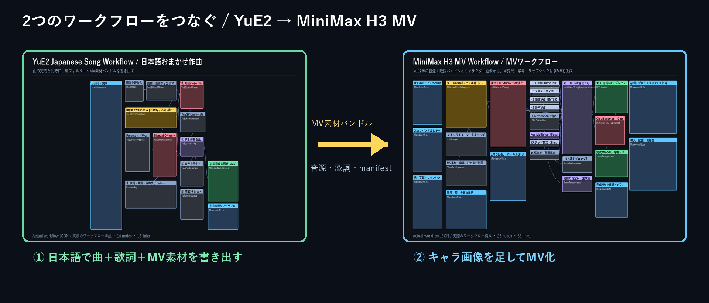
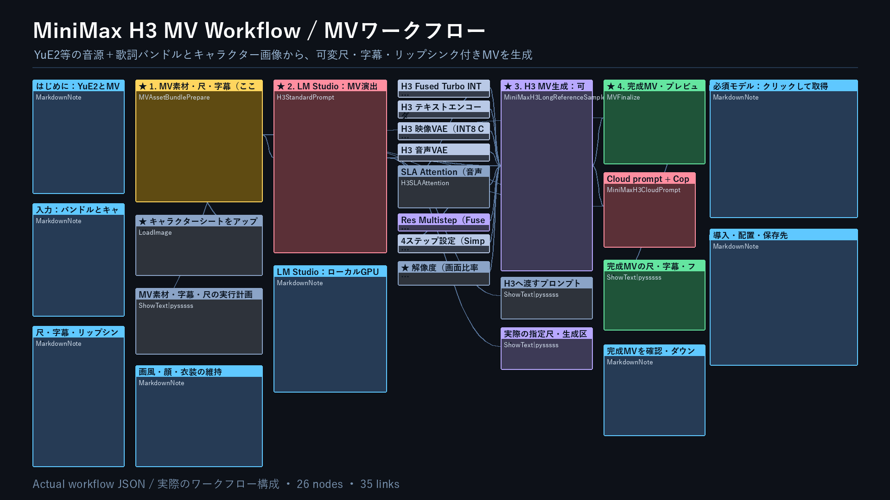

# MiniMax H3 T2V / I2V / Ref2V / Music Video Workflows for ComfyUI / ComfyUI向けMiniMax H3 T2V・I2V・Ref2V・MVワークフロー — v1.2.0


<!-- bilingual-readme: paired english-japanese -->

This ComfyUI distribution generates video with MiniMax H3 in four modes: **text to video (T2V)**, **video from a starting image (I2V)**, **video guided by reference images (Ref2V)**, and a **music-video workflow** that combines a finished song, exact lyrics, and a character image. It supports Japanese direction, fixed test clips or full-song variable duration, subtitles, source-audio lip-sync guidance, title/end-link overlays, fades, per-segment review, and resume. / MiniMax H3で、**文章から動画（T2V）**、**開始画像から動画（I2V）**、**参照画像から動画（Ref2V）**、さらに完成曲・正確な歌詞・キャラクター画像を組み合わせる**MVワークフロー**を提供します。日本語の演出指示、短い検証尺または曲末までの可変尺、字幕、元音源に合わせたリップシンク指示、タイトル／終了リンク表示、フェード、区間検査、途中再開に対応します。

This README walks first-time users through choosing a workflow, installing every required component, placing the files correctly, and running the first generation. See [README_JA.md](README_JA.md) for additional node-level details and examples, and [VALIDATION.md](VALIDATION.md) for the exact validation scope and remaining unverified areas. / このREADMEでは、初めて使う人が「どれを選ぶか」「何を入れるか」「どこへ置くか」「最初に何を実行するか」を順番に確認できます。さらに詳しいノード設定と操作例は [README_JA.md](README_JA.md)、実施済みの検証と未確認範囲は [VALIDATION.md](VALIDATION.md) を参照してください。

> [!IMPORTANT]
> This project covers H3 T2V, I2V, Ref2V, and MV generation. The MV workflow is designed to consume the portable asset bundle exported by [ComfyUI-YuE2-Japanese](https://github.com/FURUYAN1234/ComfyUI-YuE2-Japanese), while remaining usable with compatible bundles from other singing systems. For a first installation, use the named ZIP under Assets on the [latest Release](https://github.com/FURUYAN1234/comfyui-h3-workflows/releases/latest), not the GitHub source archive or an individual JSON. / 本プロジェクトはH3のT2V・I2V・Ref2V・MV生成を扱います。MVは [ComfyUI-YuE2-Japanese](https://github.com/FURUYAN1234/ComfyUI-YuE2-Japanese) が書き出す可搬MV素材バンドルを直接読め、同形式を作れる他の歌声システムにも応用できます。初回導入ではGitHubのSource codeやJSON単体ではなく、[最新Release](https://github.com/FURUYAN1234/comfyui-h3-workflows/releases/latest)の名前付きZIPを使用してください。



YuE2 completes a song and simultaneously creates a separate `output/mv-assets/...` folder. The MV workflow reads that folder and adds the character image, H3-generated visuals, subtitles, lip-sync guidance, and finishing overlays. / YuE2は曲の完成と同時に、曲フォルダーとは別の `output/mv-assets/...` を作ります。MV側はそのフォルダーを読み、キャラクター画像、H3映像、字幕、リップシンク指示、タイトル／リンク表示を加えます。

[](https://github.com/FURUYAN1234/comfyui-h3-workflows/releases/latest)
[](https://github.com/comfyanonymous/ComfyUI)
[](#configure-lm-studio)

## What you can do / できること

| Mode / 方式 | Required input / 必要な入力 | Best suited for / 向いている用途 |
|---|---|---|
| **T2V** | No image / 画像なし | Create characters, backgrounds, and action from text; also the best first-run check / 人物、背景、動作を文章から作る。初回の動作確認にも向く |
| **I2V** | One starting image / 開始画像1枚 | Use an existing image as the first frame and animate its composition / 手元の画像を最初のフレームとして、その構図から動かす |
| **Ref2V** | One to five reference images / 参照画像1〜5枚 | Reference a character, face, hairstyle, clothing, or other visual details while creating a different scene or composition / 人物、顔、髪型、服装などを参照し、別の場面や構図を作る |
| **MV** | MV asset bundle + one character image / MV素材バンドル＋キャラクター画像1枚 | Turn a YuE2 or compatible song into a fixed-length test MV or a full-song variable-length MV / YuE2等の曲を短い検証MVまたは曲末までの可変尺MVにする |

Key features: / 主な機能は次のとおりです。

- Fused 4-step video generation with SLA; 2 additional audio-refinement steps at denoise 0.5 / 映像はFused 4ステップ＋SLA、音声は追加2ステップ・denoise 0.5
- Local conversion of Japanese instructions into an H3 prompt through LM Studio / 日本語の指示をLM StudioのローカルモデルでH3向けプロンプトへ変換
- A direct-input path for a finished English H3 prompt / 完成済みの英語H3プロンプトを直接入力する経路
- Variable duration rather than a fixed 15 seconds; long videos are generated and joined in segments / 15秒固定ではない可変尺。長尺は複数区間に分けて生成・結合
- Per-segment visual review, Japanese speech review, and up to five total attempts per segment including the first attempt / 区間ごとの画像検査、日本語音声検査、初回を含む累計最大5回の区間試行
- Resume from intermediate data and regenerate from a selected segment / 中間データを使った途中再開と、指定区間からの再生成
- Model download URLs, destinations, sizes, and SHA-256 hashes in [`models.json`](models.json) / モデル取得URL、配置先、サイズ、SHA-256を [`models.json`](models.json) に収録
- No cloud API key; Japanese conversion, visual review, and speech review all run locally / クラウドAPIキー不要。日本語変換、画像検査、音声検査はローカル処理
- Portable MV input: `master.flac`, exact display/singing lyrics, `lyrics.json`, and `mv_manifest.json` / 可搬MV入力：最終音源、表示／歌唱用歌詞、`lyrics.json`、`mv_manifest.json`
- MV duration can be a requested number of seconds or the remaining song length; the last image and audio are faded together / MVは任意秒数または音源末尾までを選択でき、最後に映像と音声を同時フェード
- Original 2D, 3D, or live-action appearance is explicitly preserved in the generated direction; identity is reference-guided rather than guaranteed / 元画像が2D・3D・実写のどれかを判定して画風維持を明示。人物同一性は参照誘導であり完全保証ではない

The system does not always use all five attempts. It advances as soon as a segment passes. If the limit is reached, it selects the best candidate that meets the applicable conditions. Because AI review can still miss problems, always watch and listen to the finished video. / 区間試行は必ず5回行う仕組みではありません。合格した時点で次の区間へ進み、上限に達した場合は条件に合う候補から最良のものを使用します。AI検査にも見落としがあるため、完成動画は最後に目と耳で確認してください。

## Changes in v1.2.0 / v1.2.0の変更点

Added the public `MV_H3_YuE2-LMStudio_v1.2.0.json` workflow and the reusable `comfyui-mv-workflow` custom node. The new input node reads the YuE2 MV bundle by relative folder name under `ComfyUI/output`, accepts a standard ComfyUI `IMAGE`, validates the manifest and source hashes, clips a requested section, and prepares exact lyrics for subtitles and source-audio-driven H3 direction. / 公開用 `MV_H3_YuE2-LMStudio_v1.2.0.json` と汎用 `comfyui-mv-workflow` ノードを追加しました。入力ノードは `ComfyUI/output` 以下の相対フォルダー名でYuE2のMV素材を読み、標準 `IMAGE` を受け、manifestと元ファイルのハッシュを検査し、指定区間を切り出して字幕・元曲連動のH3演出へ正確な歌詞を渡します。

The workflow includes 20-second test mode and full-song mode, subtitle ON/OFF, Whisper alignment, character/style preservation, LM Studio GPU loading followed by CPU release, H3 generation, original-audio finishing, title fade, end-link overlap, and synchronized audio/video fade-out. / 20秒などの検証尺と音源末尾までの可変尺、字幕ON/OFF、Whisper時刻合わせ、人物・画風維持、LM StudioのGPU読込→CPU復帰、H3生成、元曲での仕上げ、タイトルのフェード、終了リンクの重ね表示、映像・音声の同時フェードを1本にまとめました。

The public workflow was loaded in ComfyUI without missing nodes. The new relative-bundle and `IMAGE` input path passed unit/integration checks. A 20.000-second 864×480, 24fps H.264/AAC validation MV completed through the normal workflow path with four subtitle cues and synchronized finishing fades. Character identity remains model-dependent and must be visually checked. / 公開JSONはComfyUIで不足ノードなく読込確認済みです。相対バンドル＋`IMAGE`経路は単体・結合検査に合格しました。通常経路では20.000秒、864×480、24fps、H.264/AAC、字幕4区間、終了フェード付きMVを実生成しています。顔の一致度は生成モデル依存のため目視確認が必要です。

The v1.1.9 timeline and mixed-audio-prohibition fixes remain included. / v1.1.9のタイムライン検査と混合音声禁止の修正も引き続き含みます。

## Package contents / 配布内容

The Release ZIP contains: / Release ZIPには次のファイルが入っています。

**English / 英語**

```text
H3_T2V-I2V-Ref2V-MV_20260922210437_v1.2.0/
├─ workflows/                 # T2V, I2V, Ref2V, and MV workflows
├─ custom_nodes/              # Six required custom-node packages
├─ docs/assets/               # Actual workflow diagrams and note thumbnail
├─ requirements.txt           # Python dependencies
├─ models.json                # Model names, destinations, URLs, and hashes
├─ configure_audio_audit.py   # Local Whisper setup helper
├─ verify_package.py          # Extracted-package verifier
├─ README.md / README_JA.md
├─ VALIDATION.md
├─ LICENSES_AND_NOTICES.md
└─ SHA256SUMS.json
```

**Japanese / 日本語**

```text
H3_T2V-I2V-Ref2V-MV_20260922210437_v1.2.0/
├─ workflows/                 # T2V・I2V・Ref2V・MVのワークフロー4本
├─ custom_nodes/              # 導入に必要なカスタムノード6パッケージ
├─ docs/assets/               # 実ワークフロー図・noteサムネイル
├─ requirements.txt           # Python依存ライブラリ
├─ models.json                # モデル名・配置先・取得URL・ハッシュ
├─ configure_audio_audit.py   # ローカルWhisper設定補助
├─ verify_package.py          # 展開した配布物の検査
├─ README.md / README_JA.md
├─ VALIDATION.md
├─ LICENSES_AND_NOTICES.md
└─ SHA256SUMS.json
```

It does not contain model weights, input images, generated videos, API keys, personal prompts, pronunciation dictionaries, or path settings from the development machine. / モデル本体、入力画像、生成動画、APIキー、個人用プロンプト、読み辞書、個人PCのパス設定は含みません。

## Requirements / 必要な環境

### Required / 必須

- [ComfyUI](https://github.com/comfyanonymous/ComfyUI) with the MiniMax H3 and V3 node APIs and `ResolutionSelector` support / MiniMax H3とV3ノードAPI、`ResolutionSelector`に対応した [ComfyUI](https://github.com/comfyanonymous/ComfyUI)
- An NVIDIA CUDA build of PyTorch / NVIDIA CUDA版PyTorchを使用できる環境
- A Triton build compatible with the installed PyTorch; use a compatible `triton-windows` build on native Windows / 使用中のPyTorchと互換性があるTriton。Windowsネイティブでは対応する `triton-windows`
- `ffmpeg` and `ffprobe` available on `PATH` / `ffmpeg` と `ffprobe` がPATHから実行できること
- Four H3 model files, approximately 40.44 GB in total / H3用モデル4ファイル（合計約40.44GB）
- LM Studio and a vision-capable local model when using Japanese conversion or per-segment AI review / 日本語変換・区間AI検査を使う場合はLM Studioと画像対応ローカルモデル
- A Transformers-format Whisper model when using Japanese speech review / 日本語音声検査を使う場合はTransformers形式のWhisperモデル

The validated development environment is WSL2 Ubuntu with an NVIDIA RTX 5080 16 GB. A 16 GB GPU is neither a minimum requirement nor a guarantee for every resolution and duration. Keep substantially more free storage than the model size for the H3 models, LM Studio model, intermediate data, and completed videos. / 確認に使用した構成はWSL2 Ubuntu、NVIDIA RTX 5080 16GBです。16GBは最低要件でも、すべての解像度・尺で動く保証でもありません。H3モデル、LM Studioモデル、中間データ、完成動画を置くため、ストレージにはモデル容量より十分大きい空きを確保してください。

> [!NOTE]
> GPU generation on native Windows, other GPUs, and other PCs has not been verified. Start with the distributed settings: **5 seconds, 16:9, and 0.4 MP**. / Windowsネイティブ、別GPU、別PCでのGPU生成は未確認です。まず配布時の **5秒・16:9・0.4MP** で動作を確認してください。

## Installation / インストール

### 1. Download and extract the Release ZIP / 1. Release ZIPを取得して展開する

1. Open the [latest Release](https://github.com/FURUYAN1234/comfyui-h3-workflows/releases/latest). / [最新Release](https://github.com/FURUYAN1234/comfyui-h3-workflows/releases/latest)を開きます。
2. Download `H3_T2V-I2V-Ref2V-MV_20260922210437_v1.2.0.zip` from Assets. / Assetsから `H3_T2V-I2V-Ref2V-MV_20260922210437_v1.2.0.zip` を取得します。
3. Extract the entire ZIP. Do not take only a workflow JSON out of the archive. / ZIPをすべて展開します。ZIPの中からJSONだけを取り出さないでください。
4. If custom nodes with the same names are already installed, move those existing folders outside ComfyUI first. / 既に同名のカスタムノードを使っている場合は、ComfyUIの外へ退避します。

### 2. Verify the extracted package / 2. 展開した配布物を検査する

Run the following command in the extracted directory. Models and a GPU are not required for this check. / 展開先で次を実行します。モデルやGPUは不要です。

```bash
python -B verify_package.py
```

If `python` is unavailable on Windows, use the command that matches your installed Python, such as `py -B verify_package.py`. A valid package finishes with: / Windowsで `python` が見つからない場合は、インストール済みのPythonに合わせて `py -B verify_package.py` などへ置き換えます。次の表示で終了すれば配布内容は正常です。

```text
Workflow OK: I2V
Workflow OK: Ref2V
Workflow OK: T2V
Package checks passed.
```

### 3. Install the six custom-node folders / 3. カスタムノード6フォルダーを配置する

Copy all six folders under `custom_nodes/` in the extracted ZIP into ComfyUI's `custom_nodes/` directory. / 展開したZIPの `custom_nodes/` にある次の6フォルダーを、ComfyUI本体の `custom_nodes/` へコピーします。

```text
ComfyUI/
└─ custom_nodes/
   ├─ comfyui-h3-standard-prompt/
   ├─ ComfyUI-MiniMax-H3-Long-Video/
   ├─ ComfyUI-H3-AudioRefine/
   ├─ ComfyUI-PlagueKind-Nodes/
   ├─ ComfyUI-Custom-Scripts/
   └─ comfyui-mv-workflow/
```

Each folder must have `__init__.py` directly inside it. Do not create a duplicated nested folder such as: / 各フォルダーの直下に `__init__.py` がある状態が正しい配置です。次のように同じフォルダー名が二重にならないようにしてください。

**English / 英語**

```text
# Incorrect
ComfyUI/custom_nodes/ComfyUI-H3-AudioRefine/ComfyUI-H3-AudioRefine/__init__.py
```

**Japanese / 日本語**

```text
# 誤った例
ComfyUI/custom_nodes/ComfyUI-H3-AudioRefine/ComfyUI-H3-AudioRefine/__init__.py
```

The four externally sourced packages are already included in the Release ZIP. Do not mix them with separately downloaded or older versions. / 外部由来の4パッケージもRelease ZIPに同梱済みです。別途取得した版や古い版と混在させないでください。

### 4. Install the Python dependencies / 4. Python依存ライブラリを入れる

Install the dependencies into **the Python interpreter actually used by ComfyUI**. / 依存ライブラリは、**ComfyUIが実際に使用するPython**へインストールします。

For ComfyUI Portable on Windows, run this from the Portable root: / Windows Portable版では、Portableのルートから実行します。

**English / 英語**

```powershell
.\python_embeded\python.exe -m pip install -r "C:\path\to\H3_T2V-I2V-Ref2V-MV_20260922210437_v1.2.0\requirements.txt"
```

**Japanese / 日本語**

```powershell
.\python_embeded\python.exe -m pip install -r "C:\展開先\H3_T2V-I2V-Ref2V-MV_20260922210437_v1.2.0\requirements.txt"
```

For a Linux or WSL venv installation, run this from the ComfyUI directory: / Linux・WSLのvenv版では、ComfyUIフォルダーから実行します。

**English / 英語**

```bash
.venv/bin/python -m pip install -r "/path/to/H3_T2V-I2V-Ref2V-MV_20260922210437_v1.2.0/requirements.txt"
```

**Japanese / 日本語**

```bash
.venv/bin/python -m pip install -r "/展開先/H3_T2V-I2V-Ref2V-MV_20260922210437_v1.2.0/requirements.txt"
```

Install the Triton build required by SLA separately, matching your OS, PyTorch, and CUDA combination. For native Windows guidance, see [triton-windows](https://github.com/woct0rdho/triton-windows). / SLAに必要なTritonはOSとPyTorchの組み合わせに合わせて別途用意します。Windowsネイティブの情報は [triton-windows](https://github.com/woct0rdho/triton-windows) を確認してください。

Check CUDA and Triton using ComfyUI's Python: / ComfyUIのPythonでCUDAとTritonを確認します。

```bash
python -c "import torch,triton; print(torch.__version__, torch.cuda.is_available(), triton.__version__)"
```

If `torch.cuda.is_available()` is `False`, check the NVIDIA CUDA PyTorch build and driver first. Replace `python` above with `python_embeded/python.exe` for Portable or `.venv/bin/python` for a venv installation. / `torch.cuda.is_available()` が `False` の場合は、先にPyTorchとCUDA環境を確認してください。ここでの `python` も、Portable版なら `python_embeded/python.exe`、venv版なら `.venv/bin/python` へ置き換えます。

Also check FFmpeg: / FFmpegも確認します。

```bash
ffmpeg -version
ffprobe -version
```

## Install the four H3 model files / H3モデル4ファイルを配置する

**English / 英語**

The models total approximately 40.44 GB. Review each model's license terms before downloading it.

| Type | File and download | Destination | Approx. size |
|---|---|---|---:|
| Video generation model | [`minimax_h3_fused_refdelta_r1024_turbo8_mystic07_int8_convrot.safetensors`](https://huggingface.co/MATLOWAI/minimax-h3-fused-turbo-int8-convrot/resolve/main/diffusion_models/minimax_h3_fused_refdelta_r1024_turbo8_mystic07_int8_convrot.safetensors) | `ComfyUI/models/diffusion_models/` | 20.98 GB |
| H3 text encoder | [`qwen3vl_32b_minimax_h3_nvfp4_awq.safetensors`](https://huggingface.co/Comfy-Org/MiniMax-H3/resolve/main/text_encoders/qwen3vl_32b_minimax_h3_nvfp4_awq.safetensors) | `ComfyUI/models/text_encoders/` | 15.69 GB |
| Video VAE | [`minimax_h3_video_vae_int8_convrot.safetensors`](https://huggingface.co/Kijai/MiniMax-H3-experimental/resolve/main/minimax_h3_video_vae_int8_convrot.safetensors) | `ComfyUI/models/vae/` | 3.17 GB |
| Audio VAE | [`minimax_h3_audio_vae_fp32.safetensors`](https://huggingface.co/Comfy-Org/MiniMax-H3/resolve/main/vae/minimax_h3_audio_vae_fp32.safetensors) | `ComfyUI/models/vae/` | 0.61 GB |

After installation, the layout is:

```text
ComfyUI/
└─ models/
   ├─ diffusion_models/
   │  └─ minimax_h3_fused_refdelta_r1024_turbo8_mystic07_int8_convrot.safetensors
   ├─ text_encoders/
   │  └─ qwen3vl_32b_minimax_h3_nvfp4_awq.safetensors
   └─ vae/
      ├─ minimax_h3_video_vae_int8_convrot.safetensors
      └─ minimax_h3_audio_vae_fp32.safetensors
```

Do not place models under `workflows/` or `custom_nodes/`. A similarly named model may use a different quantization method or be incompatible with these loaders. Use the listed files for the first run. Exact byte counts and SHA-256 hashes are in [`models.json`](models.json).

<a id="configure-lm-studio"></a>

**Japanese / 日本語**

モデルは合計約40.44GBです。リンクを開く前に、各モデルの利用条件も確認してください。

| 種類 | ファイル名・取得先 | 配置先 | 容量の目安 |
|---|---|---|---:|
| 動画生成モデル | [`minimax_h3_fused_refdelta_r1024_turbo8_mystic07_int8_convrot.safetensors`](https://huggingface.co/MATLOWAI/minimax-h3-fused-turbo-int8-convrot/resolve/main/diffusion_models/minimax_h3_fused_refdelta_r1024_turbo8_mystic07_int8_convrot.safetensors) | `ComfyUI/models/diffusion_models/` | 20.98GB |
| H3用テキストエンコーダー | [`qwen3vl_32b_minimax_h3_nvfp4_awq.safetensors`](https://huggingface.co/Comfy-Org/MiniMax-H3/resolve/main/text_encoders/qwen3vl_32b_minimax_h3_nvfp4_awq.safetensors) | `ComfyUI/models/text_encoders/` | 15.69GB |
| 映像VAE | [`minimax_h3_video_vae_int8_convrot.safetensors`](https://huggingface.co/Kijai/MiniMax-H3-experimental/resolve/main/minimax_h3_video_vae_int8_convrot.safetensors) | `ComfyUI/models/vae/` | 3.17GB |
| 音声VAE | [`minimax_h3_audio_vae_fp32.safetensors`](https://huggingface.co/Comfy-Org/MiniMax-H3/resolve/main/vae/minimax_h3_audio_vae_fp32.safetensors) | `ComfyUI/models/vae/` | 0.61GB |

配置後は次の構成になります。

```text
ComfyUI/
└─ models/
   ├─ diffusion_models/
   │  └─ minimax_h3_fused_refdelta_r1024_turbo8_mystic07_int8_convrot.safetensors
   ├─ text_encoders/
   │  └─ qwen3vl_32b_minimax_h3_nvfp4_awq.safetensors
   └─ vae/
      ├─ minimax_h3_video_vae_int8_convrot.safetensors
      └─ minimax_h3_audio_vae_fp32.safetensors
```

モデルを `workflows/` や `custom_nodes/` へ置かないでください。ファイル名が似ている別モデルでも、量子化方式やローダーの互換性が同じとは限りません。最初は表の指定ファイルを使用してください。正確なバイト数とSHA-256は [`models.json`](models.json) にあります。

## Configure LM Studio / LM Studioを設定する

LM Studio is not the video generation model. It reads Japanese video instructions and input images and prepares an English prompt for H3. If per-segment AI review is enabled, LM Studio is also used during review even when the final prompt is entered directly in English. / LM Studioは動画生成モデルではありません。日本語の動画指示と入力画像を読み、H3向けの英語プロンプトへ整えるために使います。区間AI検査を有効にしている場合は、英語直接入力でも検査時にLM Studioを使います。

1. Install [LM Studio](https://lmstudio.ai/). / [LM Studio](https://lmstudio.ai/)をインストールします。
2. Download a vision-capable local model. Validation used **Qwen3.5-9B**. / 画像認識に対応したローカルモデルを取得します。検証では **Qwen3.5-9B** を使用しました。
3. For I2V and Ref2V, install the Vision-related files needed to accept image input. / I2V・Ref2Vでは画像も渡すため、必要なVision用ファイルを揃えます。
4. Load the model in the Developer view and start the local server. / Developer画面でモデルをロードし、ローカルサーバーを起動します。
5. Set the workflow's "LM Studio model name" to the same identifier used by LM Studio. / ワークフローの「LM Studioのモデル名」を、LM Studio側の識別子と一致させます。

The distributed example settings are: / 配布時の設定例は次のとおりです。

**English / 英語**

```text
Endpoint: http://127.0.0.1:1234/v1
Model identifier: qwen-prompt-ja
```

**Japanese / 日本語**

```text
接続先: http://127.0.0.1:1234/v1
モデル識別子: qwen-prompt-ja
```

`qwen-prompt-ja` is only an example identifier. If you use another identifier in LM Studio, change the workflow to match. See [LM Studio Server](https://lmstudio.ai/docs/developer/core/server) for detailed server operation. / `qwen-prompt-ja` は任意の識別子です。LM Studioで別名を使う場合はワークフロー側も変更してください。詳しいサーバー操作は [LM Studio Server](https://lmstudio.ai/docs/developer/core/server) を参照してください。

### Return the LM model from GPU to CPU / LMモデルをGPUからCPUへ戻す設定

To enable "load the LM model onto the GPU only for conversion, then return it to the CPU before video generation," add LM Studio's bundled `lms` CLI to `PATH` and install the `lmstudio` package into ComfyUI's Python. If returning the model to the CPU fails, video generation will not start, which avoids a VRAM conflict. / 「LM変換時だけGPUへ読み込み、動画生成前にCPUへ戻す」を有効にする場合は、LM Studio同梱の `lms` CLIをPATHへ登録し、ComfyUIのPythonに `lmstudio` パッケージが必要です。CPU復帰に失敗した場合は、VRAM競合を避けるため動画生成を開始しません。

If this automatic switch is unavailable, turn it off and load the LM model on the CPU from the beginning. Prompt conversion will be slower, but the model will not compete with H3 for VRAM. / この自動切替を使えない環境では設定をOFFにし、LMモデルを最初からCPUへロードしてください。文章変換は遅くなりますが、H3が使うVRAMとの競合を抑えられます。

### Connect from WSL to LM Studio on Windows / WSLからWindowsのLM Studioへ接続する場合

When ComfyUI runs in WSL and LM Studio runs on Windows, WSL may not reach Windows through `127.0.0.1`. In that case, configure an address for the Windows host that is reachable from WSL. / ComfyUIがWSL、LM StudioがWindowsで動いている場合、WSL側の `127.0.0.1` からWindows側へ届かないことがあります。その場合は、WSLから到達できるWindows側のアドレスを接続先に設定します。

**English / 英語**

```text
http://reachable-host-address:1234/v1
```

**Japanese / 日本語**

```text
http://到達できるホストアドレス:1234/v1
```

Check it from the OS running ComfyUI: / ComfyUIを動かしているOS側から確認します。

**English / 英語**

```bash
curl http://host-address:1234/api/v1/models
```

**Japanese / 日本語**

```bash
curl http://ホストアドレス:1234/api/v1/models
```

You do not need to expose the LM Studio port to the public internet. / 外部インターネットへLM Studioのポートを公開する必要はありません。

## Configure Whisper for Japanese speech review / 日本語音声検査用Whisperを設定する

Speech review uses [Whisper large-v3-turbo](https://huggingface.co/openai/whisper-large-v3-turbo) in **Transformers format**, not GGUF. Put the model weights, `config.json`, `preprocessor_config.json`, tokenizer files, and related required files in the same folder. / 音声検査には、[Whisper large-v3-turbo](https://huggingface.co/openai/whisper-large-v3-turbo)の**Transformers形式**を使います。GGUF形式ではありません。モデル本体、`config.json`、`preprocessor_config.json`、トークナイザー関連ファイルを同じフォルダーへ置きます。

In the extracted Release ZIP directory, run this with ComfyUI's Python: / 展開したRelease ZIPのフォルダーで、ComfyUIのPythonを使って次を実行します。

**English / 英語**

```bash
python configure_audio_audit.py --comfyui "path/to/ComfyUI" --whisper-model "path/to/Whisper-model"
```

**Japanese / 日本語**

```bash
python configure_audio_audit.py --comfyui "ComfyUI本体のフォルダー" --whisper-model "Whisperモデルのフォルダー"
```

Example for ComfyUI Portable on Windows: / Windows Portable版の例です。

```powershell
C:\ComfyUI_windows_portable\python_embeded\python.exe configure_audio_audit.py --comfyui "C:\ComfyUI_windows_portable\ComfyUI" --whisper-model "D:\AI_Models\whisper-large-v3-turbo"
```

The helper writes `local_audio_audit.json` inside the Long-Video node installed in ComfyUI and backs up an existing setting. You can alternatively use the `H3_LOCAL_WHISPER_MODEL` environment variable. / 設定先は、ComfyUIへ配置したLong-Videoノード内の `local_audio_audit.json` です。既存設定はバックアップされます。環境変数 `H3_LOCAL_WHISPER_MODEL` で指定することもできます。

Speech review runs on the CPU and does not send audio to an external service. It also does not download a model automatically. If review is enabled without a configured model, execution stops. It may still miss short grunts or similar sounds, so always listen to the finished video. / 音声検査はCPUで実行し、音声を外部へ送信しません。モデルの自動ダウンロードも行いません。検査をONにしたままモデル未設定の場合は実行を停止します。短いうなり声などを見落とす場合があるため、最終動画は必ず試聴してください。

## Generate the first video / 最初の動画を生成する

Start with T2V and a short duration so the environment is easier to check. / 環境を確認しやすいT2Vから、短い設定で始めます。

1. Fully restart ComfyUI. / ComfyUIを完全に再起動します。
2. Load `workflows/T2V_H3_T2V-I2V-Ref2V_4step_20260922210437_v1.2.0.json`. / `workflows/T2V_H3_T2V-I2V-Ref2V_4step_20260922210437_v1.2.0.json` を読み込みます。
3. Confirm that no missing node is shown in red. / 赤い不足ノードがないことを確認します。
4. Confirm that each of the four model loaders selects the specified file. / 4つのモデルローダーで、指定ファイルが選択されていることを確認します。
5. Start the LM Studio server and load its model if you use Japanese input or per-segment AI review. / 日本語入力または区間AI検査を使う場合は、LM Studioのサーバーとモデルを起動します。
6. Set duration to **5 seconds**, aspect ratio to **16:9**, and pixel target to **0.4 MP**. / 秒数を **5秒**、画面比率を **16:9**、画素数を **0.4MP** にします。
7. If the prompt body also states a duration, use either "5 seconds total" or `Duration: 5 seconds` so both settings agree. / 本文にも尺を書く場合は「全体5秒」または `Duration: 5 seconds` にそろえます。
8. Queue the workflow, then inspect the final prompt, execution plan, and completed video. / 「実行する」を押し、最終プロンプト、実行計画、完成動画を確認します。

The first model load can take time. After T2V works, move to I2V or Ref2V as appropriate. / 初回はモデルの読み込みに時間がかかります。T2Vが動いたら、用途に応じてI2VまたはRef2Vへ進みます。

### Use I2V / I2Vを使う

Open `workflows/I2V_H3_T2V-I2V-Ref2V_4step_20260922210437_v1.2.0.json` and upload one image to "Starting image." For the first run, match the source image and video aspect ratios so cropping or resizing effects are easy to identify. / `workflows/I2V_H3_T2V-I2V-Ref2V_4step_20260922210437_v1.2.0.json` を開き、「開始画像」へ画像を1枚アップロードします。入力画像と動画の比率を最初はそろえると、切り抜きやリサイズの影響を確認しやすくなります。

### Use Ref2V / Ref2Vを使う

Open `workflows/Ref2V_H3_T2V-I2V-Ref2V_4step_20260922210437_v1.2.0.json` and place an image in "Reference image 1," which is required. To use images 2 through 5, add them in order, select the corresponding nodes, and enable each with `Ctrl+B`. Enabling an empty image node stops execution before generation. / `workflows/Ref2V_H3_T2V-I2V-Ref2V_4step_20260922210437_v1.2.0.json` を開き、「参照画像1」へ画像を入れます。画像1は必須です。画像2〜5を使う場合は順番に画像を入れ、対象ノードを選択して `Ctrl+B` で有効にします。空の画像ノードを有効にすると実行前に止まります。

When using multiple images, describe each role in the prompt: / 複数画像を使う場合は、役割を文章で分けてください。

**English / 英語**

```text
Image 1 is the reference for the character's face and hairstyle.
Image 2 is the clothing reference.
Image 3 is the reference for the background atmosphere.
Only one character appears in the finished video.
```

## Create a music video from YuE2 or another singing system / YuE2等の曲からMVを作る



1. In [ComfyUI-YuE2-Japanese v1.6.0](https://github.com/FURUYAN1234/ComfyUI-YuE2-Japanese/releases/tag/v1.6.0), generate a song. Node ⑥ creates `ComfyUI/output/mv-assets/TITLE_TIMESTAMP_ID/` at the same time as the normal song folder. / [ComfyUI-YuE2-Japanese v1.6.0](https://github.com/FURUYAN1234/ComfyUI-YuE2-Japanese/releases/tag/v1.6.0)で曲を生成します。通常の曲フォルダーと同じ実行で、⑥が `ComfyUI/output/mv-assets/曲名_日時_ID/` を別途作ります。
2. Open `workflows/MV_H3_YuE2-LMStudio_v1.2.0.json`. Enter that relative folder as `mv-assets/TITLE_TIMESTAMP_ID`; an absolute path is not required. / `workflows/MV_H3_YuE2-LMStudio_v1.2.0.json` を開き、`mv-assets/曲名_日時_ID` の相対名を入力します。絶対パスは不要です。
3. Upload one character sheet with the standard `LoadImage` node. Use a clean reference that shows the intended face, hair, body proportions, and clothing. / 標準 `LoadImage` へキャラクターシートを1枚アップロードします。顔・髪・体格・服装が分かる参照を使います。
4. In the large Japanese direction field, describe the mood or write “お任せ”. The bundled rules ask LM Studio to retain the input's 2D anime, 3D, or live-action appearance and avoid unauthorized redesign. / 大きな日本語欄へMVの雰囲気を書くか「お任せ」と入力します。同梱ルールは入力が2Dアニメ・3D・実写のどれかを維持し、勝手な別デザイン化を避けるよう指示します。
5. Select `任意秒数` for a short test such as 20 seconds, or `音源末尾まで（可変尺）` for a complete song. `start_seconds` can begin from another section. / 20秒等の検証は `任意秒数`、1曲完走は `音源末尾まで（可変尺）` を選びます。`start_seconds` で途中からも開始できます。
6. For subtitles, enable alignment and point `whisper_model_path` to a Transformers-format Whisper folder, normally `models/whisper/whisper-large-v3-turbo`. The exporter intentionally does not invent timestamps; it passes exact lyrics with `timing_status: not_aligned`, and this node aligns them to the final master audio. / 字幕を使う場合は時刻合わせをONにし、`whisper_model_path` へTransformers形式Whisperを指定します。標準は `models/whisper/whisper-large-v3-turbo` です。書き出し側は時刻を捏造せず `timing_status: not_aligned` で正確な歌詞を渡し、このノードが最終音源へ合わせます。
7. Queue the workflow. The final node restores the original song audio, burns subtitles when enabled, overlays a top-left title that fades out, adds the configured link at the lower right near the end, and fades picture and sound together. The node preview includes ComfyUI's normal download control. / 実行すると、最後のノードが元曲音声へ戻し、必要なら字幕を焼き込み、左上タイトルをフェードアウト、終盤に右下リンクを重ね、映像と音声を同時にフェードします。最終ノードのプレビューから通常どおりダウンロードできます。

Bundle contract / バンドル仕様:

```text
ComfyUI/output/mv-assets/TITLE_TIMESTAMP_ID/
├─ master.flac            # final uncut source song / 最終元曲
├─ lyrics_display.txt     # exact display lyrics / 表示用歌詞
├─ lyrics_singing.txt     # readings used for singing / 歌唱用読み
├─ lyrics.json            # machine-readable lyrics / 機械可読歌詞
├─ mv_manifest.json       # schema, hashes and timing status / 仕様・ハッシュ・時刻状態
└─ README.txt
```

Other singing systems can use the same MV workflow by producing this contract, or by connecting a compatible exporter that accepts standard ComfyUI `AUDIO` and metadata. / 他の歌声システムでも同じバンドル仕様を出すか、標準ComfyUI `AUDIO` とメタデータを受ける互換書き出しノードへ接続すれば再利用できます。

The visual reference is guidance, not a face-lock guarantee. If the face, hairstyle, or clothing drifts, improve the sheet, shorten the shot, or regenerate the affected segment; do not treat one successful sample as a universal identity guarantee. / キャラクター画像は参照誘導であり、顔固定の保証ではありません。顔・髪・服が崩れた場合は、シート改善、カット短縮、該当区間の再生成で確認してください。単一サンプルの成功を全素材の保証にはしません。

**Japanese / 日本語**

```text
画像1は人物の顔と髪型の参照。
画像2は服装の参照。
画像3は背景の雰囲気の参照。
完成動画には人物を一人だけ登場させる。
```

## Choose the correct prompt field / プロンプト入力欄の使い分け

The large prompt node has three fields with different roles. / 大きなプロンプトノードには、役割が異なる3つの欄があります。

| Field / 欄 | Content / 入れる内容 | Behavior / 動作 |
|---|---|---|
| ① Top / ① 一番上 | Video instructions written in Japanese or another language / 日本語などで書いた動画の指示 | Converted by LM Studio into an H3-oriented prompt / LM StudioでH3向け文章へ変換 |
| ② Middle / ② 中央 | Base rules sent to LM Studio / LM Studioへ渡す基本ルール | Normally leave unchanged / 通常は変更しない |
| ③ Bottom / ③ 一番下 | Finished English H3 prompt / 完成済みの英語H3プロンプト | Used directly when field ① is empty / ①が空欄のとき、そのまま使用 |

When field ① contains text, it takes priority and LM Studio performs the conversion. To use field ③ directly, leave field ① completely empty. Execution is unavailable if both fields ① and ③ are empty. / ①に文章がある場合は①が優先され、LM Studioによる変換が行われます。③を直接使う場合は①を完全に空にしてください。①と③が両方空の場合は実行できません。

Minimal T2V example using direct English input: / 英語を直接使うT2Vの最小例です。

```text
Duration: 5 seconds

integrated_multimodal_description: Soft anime style. One adult traveler stands on a quiet park path, waves once slowly at the camera, then rests their hand and smiles. A gentle breeze moves their hair and jacket. One continuous shot with a fixed camera. No speech or on-screen text.

overall_soundscape: Soft wind, rustling leaves and distant birds.

non_diegetic_music: N/A
```

The displayed "Prompt sent to H3" and execution plan are read-only confirmation outputs. To change the next run, edit field ① or ③. / 「H3へ渡すプロンプト」や実行計画の表示欄は確認用です。次回の入力を変える場合は①または③を編集してください。

## Default duration, resolution, and audio settings / 秒数・解像度・音の既定値

| Item / 項目 | Distributed setting / 配布時の設定 |
|---|---|
| Duration / 秒数 | 15 seconds; 5 seconds recommended for the first check / 15秒。初回確認は5秒を推奨 |
| Frame rate / フレームレート | 24 fps / 24fps |
| Aspect ratio / 画面比率 | 16:9 |
| Pixel target / 画素数 | 0.4 MP / 0.4MP |
| Example actual output / 実出力の確認例 | 864×480 |
| Video / 映像 | `res_multistep` / `simple` / 4 steps / `res_multistep` / `simple` / 4ステップ |
| SLA | 0.9 |
| Audio refinement / 音声再精錬 | 2 steps / denoise 0.5 / 2ステップ / denoise 0.5 |
| Segment attempts / 区間試行 | Up to five total, including the first; ends early when accepted / 初回を含む累計最大5回。合格時は早期終了 |

If the prompt body states `Duration: 30 seconds` or "30 seconds total," that explicit duration overrides the numeric field. Use only one duration statement in the prompt body. After queueing, check `duration_seconds` and `segment_count` in the execution plan. / 本文に `Duration: 30 seconds` や「全体30秒」と書いた場合は、数値欄より本文の明示尺が優先されます。尺指定は本文中で一つに統一してください。実行後は実行計画の `duration_seconds` と `segment_count` を確認します。

Long videos are generated in segments. A 30-second configuration with a 39-frame continuation context uses 13 + 13 + 4-second segments and joins them into 720 frames at 24 fps. For longer durations, describing what happens in the first and second halves helps reduce unnatural repetition of the same action. / 長尺は区間に分けて生成します。39フレーム継続条件の30秒構成では、13＋13＋4秒の3区間として生成し、24fps・720フレームへ結合します。秒数を増やす場合は、前半・後半で何をするかも文章に書くと、同じ動作の不自然な反復を抑えやすくなります。

Specify BGM in the prompt. For no BGM, write `non_diegetic_music: N/A`. This tells H3 whether to generate music; it is not a feature for adding a local music file afterward. / BGMはプロンプトで指定します。BGMなしの場合は `non_diegetic_music: N/A` と書きます。これは手元の音楽ファイルを後付けする機能ではなく、H3へ音楽生成を指示する項目です。

## Output locations / 保存先

Completed videos are saved below ComfyUI's `output` directory: / 完成動画はComfyUIの `output` 以下へ保存されます。

```text
ComfyUI/output/video/MiniMax_H3/H3_T2V-I2V-Ref2V/T2V/
ComfyUI/output/video/MiniMax_H3/H3_T2V-I2V-Ref2V/I2V/
ComfyUI/output/video/MiniMax_H3/H3_T2V-I2V-Ref2V/Ref2V/
ComfyUI/output/video/MV/<title_timestamp>/final.mp4
```

Intermediate data is saved under: / 中間データは次の場所に保存されます。

**English / 英語**

```text
ComfyUI/output/h3_long_video/H3_T2V-I2V-Ref2V/<mode>/<cache>/
```

**Japanese / 日本語**

```text
ComfyUI/output/h3_long_video/H3_T2V-I2V-Ref2V/<方式>/<キャッシュ>/
```

Longer videos create more segment data, prompts, and latent data. Check available disk space regularly. / 長尺ほど区間データ、プロンプト、潜在データが増えます。空き容量を定期的に確認してください。

## Resume or regenerate from a segment / 途中から再開・区間を再生成する

When resuming, keep these values consistent with the original run: / 再開時は、最初の実行と次の条件をそろえます。

- `cache_name`: fix it to the exact cache name that was created / `cache_name`：実際に作成された同じキャッシュ名を固定
- Model, input images, seed, and requested duration: keep them the same as the first run / 使用モデル、入力画像、シード、指定尺：最初の実行と同じ
- `noise_seed`: `fixed` / `noise_seed`：`fixed`
- `resume`: ON / `resume`：ON
- `reroll_from_segment`: first segment to regenerate, using a **zero-based index** / `reroll_from_segment`：再生成を始める区間。**0始まり**
- `stop_after_segment`: set a segment number only when stopping partway; use `-1` to continue through the end / `stop_after_segment`：途中で止める場合だけ区間番号を指定。最後まで進める場合は `-1`
- `reroll_feedback`: optional description of what should be corrected in the current segment / `reroll_feedback`：現在区間で直したい点を記入可能

For a 30-second video split into 13 + 13 + 4 seconds, `reroll_from_segment=1` regenerates everything from 13–26 seconds onward, while `2` regenerates only 26–30 seconds. A different `cache_name` cannot inherit the previous attempts or intermediate state. / 30秒を13＋13＋4秒に分ける構成では、`reroll_from_segment=1` は13〜26秒以降、`2` は26〜30秒だけを再生成します。別の `cache_name` では以前の試行回数や中間状態を引き継げません。

## Troubleshooting / よくあるトラブル

| Symptom / 症状 | What to check / 確認すること |
|---|---|
| A node is red or reported missing / ノードが赤い・不足と表示される | Check that all six folders are installed directly, no duplicated nesting exists, dependencies were installed into ComfyUI's Python, and the startup log has no `ImportError` / 6フォルダーを正しく配置したか、二重フォルダーになっていないか、ComfyUIのPythonへ依存を入れたか、起動ログにImportErrorがないか |
| A model is absent from the list / モデルが一覧に出ない | Check filename, extension, destination, and download completion, then refresh the model list or restart ComfyUI / ファイル名、拡張子、配置先、ダウンロード完了を確認し、モデル一覧の更新またはComfyUI再起動を行う |
| CUDA is unavailable / CUDAが使えない | Run `torch.cuda.is_available()` with ComfyUI's Python and check the NVIDIA CUDA PyTorch build and driver / ComfyUIのPythonで `torch.cuda.is_available()` を確認し、NVIDIA CUDA版PyTorchとドライバーを確認する |
| Triton error / Triton関連で止まる | Confirm that Triton matches PyTorch, CUDA, and the OS; for native Windows, check the `triton-windows` compatibility table / PyTorch、CUDA、OSに対応するTritonか確認する。Windowsネイティブは `triton-windows` の対応表を確認する |
| `ffmpeg` or `ffprobe` is missing / `ffmpeg` / `ffprobe` が見つからない | Confirm that both commands run from `PATH` / 両コマンドがPATHから実行できるか確認する |
| Cannot connect to LM Studio / LM Studioへ接続できない | Confirm that the server is running, the model is loaded, and the identifier and endpoint match; from WSL, use an address that can reach Windows / サーバー起動、モデルのロード、識別子、接続先を確認する。WSLではWindows側へ届くアドレスを使う |
| LM Studio server responds with 404 / LM Studioサーバーは動くが404 | Confirm that the model with the configured identifier is still loaded and was not unloaded by TTL or another setting / 指定した識別子のモデルがロード中か、TTLなどでアンロードされていないか確認する |
| Stops while returning the LM model to CPU / LMモデルのCPU復帰で止まる | Check the `lms` CLI and `lmstudio` package; if automatic switching is unavailable, turn it off and load the LM model on CPU / `lms` CLIと `lmstudio` パッケージを確認する。自動切替を使わない場合はOFFにしてCPUロードする |
| Stops during speech review / 音声検査で止まる | Configure a Transformers-format Whisper folder and confirm that all required files are together / Transformers形式Whisperのフォルダーを設定したか、必要ファイルが同じ場所にあるか確認する |
| I2V or Ref2V stops before generation / I2V・Ref2Vが実行前に止まる | Add the required image and make sure an empty optional image node is not enabled / 必須画像を入れたか、空の追加画像ノードを有効にしていないか確認する |
| Out of memory / メモリー不足 | Return to 0.4 MP and 5 seconds, and move the LM Studio model to CPU; shortening duration may not fix memory needed just to load the models / 0.4MP・5秒へ戻す。LM StudioモデルをCPUへ移す。モデル読込時点の不足は尺短縮だけでは解消しない場合がある |
| Changing the numeric duration has no effect / 秒数欄を変えても長さが変わらない | Check whether `Duration` or an explicit total duration in the prompt body is overriding it / 本文中の `Duration` または「全体○秒」が優先されていないか確認する |
| The same action repeats / 同じ動作が繰り返される | Describe the action for each part of the long video, then inspect the final prompt and execution plan / 長尺の各区間で何をするかを明記し、最終プロンプトと実行計画を確認する |
| BGM or speech differs from the request / BGMや台詞が意図と違う | Inspect `overall_soundscape`, `non_diegetic_music`, and dialogue instructions in the exact final prompt sent to H3 / 実際にH3へ渡された最終プロンプトの `overall_soundscape` と `non_diegetic_music`、台詞指定を確認する |
| MV bundle is not found / MV素材が見つからない | Use `mv-assets/FOLDER_NAME` relative to `ComfyUI/output`, or verify the absolute folder; do not select the normal `audio/YuE2` song folder / `ComfyUI/output` 基準の `mv-assets/フォルダー名` を指定し、通常の `audio/YuE2` 曲フォルダーと取り違えていないか確認する |
| MV subtitles fail / MV字幕で止まる | Confirm the Transformers Whisper folder and `ffmpeg` fonts; turn subtitles OFF to isolate video generation from alignment / Transformers形式WhisperとFFmpegのフォントを確認し、切り分け時は字幕OFFで映像生成だけを試す |
| Character looks different / キャラクターが似ない | Use a clearer sheet, keep style/identity rules enabled, reduce simultaneous characters, and regenerate the affected segment; H3 reference guidance is not exact face replacement / 明瞭なシート、画風・同一性ルール、人数削減、該当区間再生成を試す。H3参照は顔置換ではない |

## Validated scope and limitations / 検証済みの範囲と制限

- T2V, I2V, and Ref2V generation were run in the development environment / 開発環境ではT2V・I2V・Ref2Vの実生成を実施済み
- For a 30-second T2V run, the ending was resumed from a cache generated through the middle, reaching 30 seconds and 720 frames / T2Vの30秒生成で、中盤まで生成したキャッシュから終盤だけ再開し、30秒・720フレームへの到達を確認
- For v1.2.0, four workflow JSON files, six package imports, the relative MV-bundle + `IMAGE` path, variable/fixed duration logic, subtitle timing, finishing overlays, and Release ZIP reconstruction were checked / v1.2.0では4本のJSON、6パッケージ、相対MVバンドル＋`IMAGE`経路、可変／固定尺、字幕時刻、仕上げ表示、配布ZIP再構築を検査
- The 20-second MV validation used the normal workflow path; output was 20.000 seconds, 864×480, 24fps, H.264/AAC, with four subtitle cues and audio correlation 0.999712 against the intended source section / 20秒MVは通常経路で実生成し、20.000秒、864×480、24fps、H.264/AAC、字幕4区間、指定元音源との相関0.999712を確認
- GPU execution on another PC and on native Windows remains unverified / 別PCとWindowsネイティブでのGPU実行は未確認

The generation model and automated review have limits. They do not guarantee identical characters or clothing in every frame, seamless long-video transitions, exact dialogue pronunciation, or complete removal of unwanted sounds and subtitles. Earlier validation videos included examples with minor subtitles or short grunts. Play the completed video and check both picture and sound. / 生成モデルと自動検査には限界があります。人物や服装の全フレーム一致、長尺の継ぎ目、台詞の正確な発音、不要音や字幕の完全排除を保証するものではありません。過去の確認動画では軽微な字幕や短いうなり声が残った例があります。完成動画を再生し、映像と音声の両方を確認してください。

See [VALIDATION.md](VALIDATION.md) for detailed validation conditions and [REPRODUCE.md](REPRODUCE.md) for rebuilding the identical package. / 詳しい検証条件は [VALIDATION.md](VALIDATION.md)、同じ配布物を再構築する手順は [REPRODUCE.md](REPRODUCE.md) にあります。

## Privacy and network access / プライバシーと通信

- No cloud API key is required. / クラウドAPIキーは不要です。
- LM Studio communication goes to a local server. / LM Studioとの通信先はローカルサーバーです。
- Whisper speech review runs locally on the CPU and does not send audio externally. / Whisper音声検査はローカルCPUで実行し、音声を外部へ送信しません。
- The Release ZIP excludes input images, generated outputs, credentials, personal paths, and personal settings. / Release ZIPに入力画像、生成物、認証情報、個人パス、個人用設定は含みません。
- A local WSL-to-Windows connection does not require exposing a port to the public internet. / WSLとWindows間のローカル接続に、外部インターネットへのポート公開は不要です。

## Licenses / ライセンス

This distribution contains components under several licenses. / この配布セットは複数のライセンスを含みます。主な構成は次のとおりです。

| Package / パッケージ | License / ライセンス |
|---|---|
| `ComfyUI-MiniMax-H3-Long-Video` | GPL-3.0-only |
| `ComfyUI-H3-AudioRefine` | MIT |
| `ComfyUI-PlagueKind-Nodes` | MIT |
| `ComfyUI-Custom-Scripts` | MIT |
| `comfyui-h3-standard-prompt` | Original portions are MIT; see the bundled documents for the combined distribution's conditions / 独自作成部分はMIT。結合構成全体の条件は同梱文書を確認 |
| `comfyui-mv-workflow` | MIT |

When redistributing or modifying the package, review [LICENSES_AND_NOTICES.md](LICENSES_AND_NOTICES.md) and the `LICENSE` file in each folder, and retain copyright notices and license text. / 再配布・改変時は [LICENSES_AND_NOTICES.md](LICENSES_AND_NOTICES.md) と各フォルダーの `LICENSE` を確認し、著作権表示とライセンス本文を保持してください。

The model weights are governed by their respective distributors' terms. MiniMax H3 is covered by the [MiniMax H3 Community License Agreement](https://huggingface.co/MiniMaxAI/MiniMax-H3/blob/main/LICENSE), which includes terms related to region, use, commercial use, and redistribution. Before use, read the original agreement and confirm that your region and intended use qualify. / モデル本体には各配布元の条件が適用されます。MiniMax H3には地域、用途、商用利用、再配布などを定めた [MiniMax H3 Community License Agreement](https://huggingface.co/MiniMaxAI/MiniMax-H3/blob/main/LICENSE) があります。利用前に、自分の地域と用途が条件を満たすか原文で確認してください。

## Related documentation / 関連ドキュメント

- [README_JA.md](README_JA.md): additional node-level installation and usage details in Japanese / [README_JA.md](README_JA.md)：ノードごとの詳しい導入・操作説明
- [VALIDATION.md](VALIDATION.md): completed validation and unverified areas / [VALIDATION.md](VALIDATION.md)：検証した内容と未確認範囲
- [REPRODUCE.md](REPRODUCE.md): deterministic Release ZIP reconstruction / [REPRODUCE.md](REPRODUCE.md)：配布ZIPの決定的な再構築手順
- [LICENSES_AND_NOTICES.md](LICENSES_AND_NOTICES.md): licenses and redistribution notices / [LICENSES_AND_NOTICES.md](LICENSES_AND_NOTICES.md)：ライセンスと再配布時の表示
- [`models.json`](models.json): model downloads, destinations, sizes, and SHA-256 hashes / [`models.json`](models.json)：モデルの取得先、配置先、容量、SHA-256
- [Japanese note article](https://note.com/happy_duck780/n/n15e732b3147b)：screen guide, input examples, installation, and detailed operation / [note解説記事](https://note.com/happy_duck780/n/n15e732b3147b)：画面の見方、入力例、導入と操作の詳しい説明
- [ComfyUI-YuE2-Japanese](https://github.com/FURUYAN1234/ComfyUI-YuE2-Japanese): creates songs and the portable MV bundle / 曲と可搬MV素材バンドルを同時生成
- [YuE2 note guide](https://note.com/happy_duck780/n/n57df44cf7fd2): Japanese song workflow and the first half of the YuE2→MV path / 日本語作曲とYuE2→MV連携の前半
- [MV note guide](https://note.com/happy_duck780/n/ne8a84cb6db37): setup, workflow screens, 20-second test and full-song mode / [MVのnote解説](https://note.com/happy_duck780/n/ne8a84cb6db37)：導入、画面、20秒確認、1曲完走
- [GitHub Releases](https://github.com/FURUYAN1234/comfyui-h3-workflows/releases): distribution ZIP files and release history / [GitHub Releases](https://github.com/FURUYAN1234/comfyui-h3-workflows/releases)：配布ZIPと更新履歴
