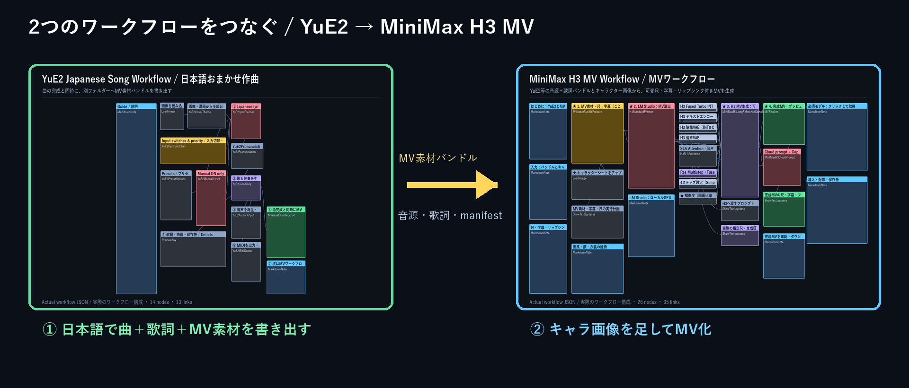

# H3 T2V, I2V, Ref2V and MV v1.2.1 installation and operation / H3 T2V・I2V・Ref2V・MV v1.2.1 導入と操作

**Source code is public and software use is free. Personal, business, internal and commissioned use, and free integration/provision require no application, prior contact or permission from FURU. Third-party and API terms remain separate. / ソースコード公開・利用無料。個人利用、業務、社内利用、受託制作、無料の組み込み・無料提供には、申請・事前連絡・FURUの許可は不要です。第三者とAPIの条件は別です。**

## Usage terms / 利用条件

> [!NOTE]
> **Current scope / 現行の適用範囲:** H3 v1.2.1: MIT for FURU original contributions; per-package GPL-3.0-only/MIT/Apache-2.0 for bundled nodes. / FURU独自部分はMIT。同梱ノードはパッケージごとにGPL-3.0-only・MIT・Apache-2.0。
>
> Source code is public and software use is free. Personal, business, internal and commissioned use, and free integration/provision require no application, prior contact or permission from FURU. Third-party and API terms remain separate. / ソースコード公開・利用無料。個人利用、業務、社内利用、受託制作、無料の組み込み・無料提供には、申請・事前連絡・FURUの許可は不要です。第三者とAPIの条件は別です。
>
> You may publish, sell, monetize and deliver text, images, comics, videos and other outputs made with the software without application, individual permission, fees or attribution to FURU. / 道具として制作した文章・画像・漫画・動画等は公開・販売・収益化・納品できます。FURUへの申請・個別許可・利用料・クレジット表記は不要です。
>
> Free Web articles, paid note introductions, and independently authored explanations, reviews and courses require no permission, prior contact or fees to FURU if copies or modified versions of the software are not included in the product. / 無料Web記事、note等の有料紹介記事、独自の解説・レビュー・講座は、対象ソフトウェアの複製・改変版を商品に含めなければ、FURUへの許可・事前連絡・利用料は不要です。
>
> FURU permits screenshots and operation videos for introductions insofar as FURU can authorize them, and ordinary links to distribution pages. Check rights and conditions for third-party works, images, materials, audio and other content shown in them separately. / FURUが許諾できる操作画面・操作動画の紹介掲載と、通常の配布ページへのリンクを認めます。掲載した第三者の作品・画像・素材・音声等の権利と条件は別途確認してください。
>
> Free redistribution and integration must follow each applicable license: retain the required copyright/license/third-party notices and identify modifications where required. FURU asks services to make their applicable notices available on an accessible information page, without adding obligations beyond existing licenses. Do not falsely imply official FURU publication, endorsement or partnership. / 無料再配布・無料組み込みでは各適用ライセンスに従い、必要な著作権表示・許諾文・第三者ライセンスを保持し、該当する改変を明示してください。サービスでは利用者が確認できる説明ページに適用条件を案内することをお願いしますが、既存ライセンスを超える義務は追加しません。FURUの公式・公認・提携と偽って表示しないでください。
>
> Current MIT, Apache-2.0 and GPL-3.0 grants also allow software sales, paid distribution, integration into paid offerings, paid functionality and software copies in paid teaching materials or purchaser/member bonuses, subject to the respective license obligations. FURU prior permission is not additionally required for those licensed uses. The seven-app commercialization permission policy is not retroactively imposed on these already licensed projects. A third-party license, model or API may impose separate limits that FURU cannot waive. / 現行のMIT・Apache-2.0・GPL-3.0許諾では、各ライセンスの義務を満たせば、ソフトウェアの販売・有料配布、有料商品等への組み込み、機能の有料提供、有料教材・購入者限定特典・会員向け配布への複製同梱も認められます。その許諾内の利用へFURUの事前許可を追加で求めません。7アプリの商品化の事前許可方針を、既に許諾済みの本プロジェクトへ遡及適用しません。第三者ライセンス・モデル・APIには別の制限があり、FURUは免除できません。
>
> Advertising revenue or voluntary donations alone do not make software access paid in FURU's usage guidance. Internal-only integration, use as your own production tool, commissioned creation and sales/delivery of completed works do not require FURU permission. This does not redefine third-party NonCommercial terms; free access with advertising can still require a separate assessment under those terms. / FURUの利用案内では広告収益や任意の寄付だけでは機能の有料提供として扱いません。社内だけの組み込み、自分で道具として使う受託制作・完成作品の販売・納品にはFURUの許可は不要です。この区分は第三者の非商用条件の意味を変更せず、広告付きの無料提供なども第三者条件を別途判断してください。
>
> If you seek a separately negotiated permission beyond an applicable license, contact FURU with the project/version/files, use, recipients and charging arrangement. Permission is effective when FURU replies by email or another recorded method expressly granting permission and its scope. No paper contract or seal is needed. An inquiry, automatic reply or silence is not permission. The existing licensed uses above require no such inquiry. FURU cannot grant rights belonging to someone else. / 適用ライセンスの範囲外で個別の許可を求める場合は、プロジェクト・版・ファイル、利用方法、提供先、料金の有無を添えてFURUへお問い合わせください。FURUがメール等の記録に残る方法で許可の旨と対象範囲を返信すれば、その範囲で有効です。紙の契約書・押印は不要です。問い合わせ送信、自動返信、無応答だけでは許可になりません。前記の既存許諾内の利用には、この問い合わせは不要です。FURUは他者の権利を許可できません。
>
> Using the software alone does not give FURU rights in your outputs or apply software terms to those outputs. Copies or modified software included in an output remain separately subject to their applicable software licenses. Copyright eligibility/ownership, third-party rights, contracts and API provider terms must be assessed separately. / 利用しただけでFURUが成果物の権利を取得したり、ソフトウェア条件を成果物へ適用したりしません。成果物中のソフトウェア自体の複製・改変部分は、別途その適用ライセンスに従います。著作権の成立・帰属、第三者の権利、契約、API提供元の条件は別途判断してください。
>
> Valid previous MIT, GPL, Apache, Creative Commons and other grants are not revoked or narrowed. Previous releases, existing ZIPs and inherited licensed portions retain their existing permissions. This 2026-10-08 documentation revision clarifies the stated current source commits and designates no new software restrictions. A future change must identify the eligible version, files and rights holder and cannot take away valid earlier grants. / 過去に有効に付与されたMIT・GPL・Apache・Creative Commons等の許諾を取り消したり狭めたりしません。過去版・既存ZIP・従前の許諾を引き継ぐ部分は従来の許諾を保持します。2026-10-08の今回の文書改定は記載した現行ソースコミットの条件を明確化し、新たなソフトウェア制限は指定しません。将来変更する場合は適用可能な版・ファイル・権利者を明示し、以前の有効な許諾を狭めません。
>
> MiniMax H3 has a separate Community License; Qwen and Whisper models retain their source terms. / MiniMax H3は別途Community License。Qwen・Whisper等のモデルも取得元の条件に従います。
>
> [Full guidance / 利用案内全文](FURU_TERMS.md) · [Version, files and rights holders / 版・ファイル・権利者](LICENSE_SCOPE.md) · [Existing LICENSE / 既存LICENSE](LICENSE)


## Distribution scope / 配布対象

The package includes four workflows: T2V without an image, I2V with one starting frame, Ref2V with 1–5 reference images, and MV creation from a completed YuE2 or other song, lyrics and character image. Project name, mode, 14-digit timestamp and version in the filename identify each workflow. / T2V（画像なし）、I2V（開始フレーム1枚）、Ref2V（参照1〜5枚）に加え、YuE2等の完成曲・歌詞・キャラクター画像から作るMVの計4本を同梱します。ファイル名のプロジェクト名・方式・14桁日時・版番号で識別できます。

Copy the six folders in `custom_nodes/` into ComfyUI’s `custom_nodes/`. / `custom_nodes/`内の6フォルダーをComfyUIの`custom_nodes/`へコピーします。
- comfyui-h3-standard-prompt: Japanese conversion, input switching, duration planning, GPU/CPU switching and a local image-review client. / comfyui-h3-standard-prompt：日本語変換、入力切替、尺計画、GPU/CPU切替、ローカル画像検査用クライアント。
- ComfyUI-MiniMax-H3-Long-Video: variable duration, segment saving/resume, candidate selection, audio/video review and MP4 saving. / ComfyUI-MiniMax-H3-Long-Video：可変尺、区間保存と再開、候補選択、音声・映像検査、MP4保存。
- ComfyUI-H3-AudioRefine: two-step audio refinement while keeping the video fixed. / ComfyUI-H3-AudioRefine：映像を固定して音声を2ステップ再精錬。
- ComfyUI-PlagueKind-Nodes: SLA Attention. / ComfyUI-PlagueKind-Nodes：SLA Attention。
- ComfyUI-Custom-Scripts: display of the final prompt and execution plan. / ComfyUI-Custom-Scripts：最終プロンプトと実行計画の表示。
- comfyui-mv-workflow: MV asset validation, subtitle alignment and finishing with the original song, title, end link and fades. / comfyui-mv-workflow：MV素材の検査、字幕時刻合わせ、元曲・タイトル・終了リンク・フェードによる仕上げ。

Do not duplicate a node under another folder name. Move existing folders outside ComfyUI before replacement. This ZIP excludes four-panel workflows, NanoBanana cloud API settings and personal Qwen nodes. / 同名ノードを別名で二重配置しないでください。既存フォルダーはComfyUIの外へ退避します。このZIPに四コマ用ワークフロー、NanoBananaのクラウドAPI設定、個人用Qwenノードは含みません。

## Changes in v1.2.1 (2026-09-23) / v1.2.1（2026-09-23）の変更

- Reads YuE2 v1.6.1 schema-v2 character information and maps 1–12 people in one sheet to separate Subjects and stable speaker IDs. / YuE2 v1.6.1のschema v2人物情報を読み、1枚のシート内の1～12人を別々のSubjectと安定話者IDへ対応付ける。
- Expression/pose variations remain the same person; character fusion, splitting, swapping and unregistered duplicates are prohibited. / 表情・ポーズ差分は同一人物として扱い、人物の融合・分裂・入れ替わり・未登録人物の分身を禁止。
- Solo lyrics limit visible singing to one person; simultaneous lip movement is prohibited unless group singing is explicitly specified. Voice-to-character assignments are not invented from audio alone. / ソロ歌詞は見える歌唱者を1人に限定し、明示したグループ歌唱以外の二重口パクを禁止。音声だけから人物への声の割当は捏造しない。
- Schema-v1 and generic bundles without visual information keep the previous single-character path. / visual情報のないschema v1・汎用バンドルは従来の1人物経路で継続対応。
- Preserves duration review, prohibited-audio parsing, LM Studio progress, GPU-to-CPU switching, four video steps, two audio steps, variable duration and segment resume from v1.1.9. / v1.1.9までの尺検査、音声禁止解析、LM Studio進捗、GPU→CPU切替、映像4step、音声2step、可変尺、区間再開を維持。

Local dialogue review passed; human listening to the entire clip is not claimed. Restart ComfyUI after updating, save unsaved workflows and then reload the browser. / ローカルの台詞検査は合格しましたが、人による全編試聴まで確認済みとはしていません。更新後はComfyUIを再起動し、未保存ワークフローを保存したうえでブラウザーを再読み込みしてください。

## 1. Environment and placement / 1. 環境・配置

Requires NVIDIA CUDA PyTorch and ComfyUI supporting MiniMax H3, V3 node APIs and ResolutionSelector. Development generation used WSL2 Ubuntu, RTX5080 16 GB, ComfyUI 0.34.0 and frontend 1.51.9. Native Windows GPU operation is unverified. / NVIDIA CUDA版PyTorchとMiniMax H3、V3ノードAPI、ResolutionSelectorに対応したComfyUIが必要です。開発時の実生成はWSL2 Ubuntu・RTX5080 16GB・ComfyUI0.34.0・フロントエンド1.51.9で行いました。WindowsネイティブでのGPU動作は未検証です。

For ComfyUI setup see https://docs.comfy.org/installation/system_requirements . This ZIP does not modify existing PyTorch or drivers. / ComfyUI本体の準備は https://docs.comfy.org/installation/system_requirements を参照してください。既存のPyTorchやドライバーをこのZIPが変更する処理はありません。

1. Immediately after extracting the ZIP, run `python verify_package.py`; no models or GPU are needed. / ZIP展開直後に `python verify_package.py` を実行します（モデルもGPUも不要）。
2. Place the six packages and run `python -m pip install -r requirements.txt` with ComfyUI’s Python. Portable installations usually use `python_embeded/python.exe`; WSL/Linux use Python in the ComfyUI venv. / 6パッケージを配置し、ComfyUIのPythonで `python -m pip install -r requirements.txt` を実行します。Portable版は通常 `python_embeded/python.exe`、WSL/LinuxはComfyUIのvenv内Pythonを使用します。
3. Prepare Triton compatible with your PyTorch for SLA. For Windows see https://github.com/woct0rdho/triton-windows ; for Linux/WSL check a PyTorch-compatible Triton. Verify with `python -c "import torch,triton; print(torch.cuda.is_available(),triton.__version__)"`. / SLA用に使用中PyTorchと互換のTritonを用意します。Windowsは https://github.com/woct0rdho/triton-windows 、Linux/WSLはPyTorch対応のTritonを確認してください。`python -c "import torch,triton; print(torch.cuda.is_available(),triton.__version__)"` で確認できます。
4. Put FFmpeg/ffprobe on PATH. Place workflow JSONs anywhere under `user/default/workflows/` or load them through the UI. Save or preserve unsaved content in the current tab first. / FFmpeg/ffprobeをPATHへ用意します。ワークフローJSONは任意の `user/default/workflows/` 以下へ置くか、画面から読み込みます。現行タブの未保存内容は先に保存・退避してください。

## MV integration / MV連携



A song made with YuE2 v1.6.1 also creates `ComfyUI/output/mv-assets/曲名_日時_ID/`, separately from its ordinary song folder. Enter `mv-assets/曲名_日時_ID` in the MV workflow and load the same character sheet through standard LoadImage. Schema-v2 character data treats people in that sheet as separate Subjects; otherwise the previous single-character behavior applies. / YuE2 v1.6.1で曲を作ると、通常の曲フォルダーとは別に `ComfyUI/output/mv-assets/曲名_日時_ID/` が同時にできます。MVワークフローへ `mv-assets/曲名_日時_ID` と入力し、作曲時と同じキャラクターシートを標準LoadImageへ入れます。schema v2に人物情報があれば同じ画像内の複数人を別Subjectとして扱い、なければ従来どおり1人物として扱います。

For a short check choose arbitrary duration; for a full song choose variable duration until audio end. For subtitles, place Transformers-format Whisper under `ComfyUI/models/whisper/whisper-large-v3-turbo/` and enable alignment. The final node restores the original `master.flac` in place of H3 audio and saves `final.mp4` with subtitles, title, end link and audio/video fades under `ComfyUI/output/video/MV/`. / 短い確認は尺モードを「任意秒数」、1曲完走は「音源末尾まで（可変尺）」にします。字幕を使う場合はTransformers形式のWhisperを `ComfyUI/models/whisper/whisper-large-v3-turbo/` へ配置し、時刻合わせをONにします。最終ノードはH3の生成音声ではなく元の `master.flac` を戻し、字幕・タイトル・終了リンク・映像音声フェード付き `final.mp4` を `ComfyUI/output/video/MV/` へ保存します。

For multi-character sheets with no designated singer, voice timbre is not used to guess the person. Whisper timestamps and exact lyrics are used only for downstream subtitles. H3 receives singing intervals and source audio rather than lyric text, synchronizing only one registered person in solo intervals. / 歌唱者が明示されていない複数キャラシートでは、声質から人物を推測しません。Whisper時刻と正確な歌詞は後段の字幕へだけ使い、H3へは歌詞本文を渡さず、歌唱区間と元音源を使ってソロ区間の登録人物1人だけを同期させます。

LM Studio rules request preservation of the input’s 2D anime, 3D or live-action style. H3 references do not perform exact face replacement, so inspect the completed video for face, hair and clothing consistency, improve the sheet or regenerate the affected segment if needed. / 元画像の2Dアニメ・3D・実写の画風はLM Studio用ルールで維持を指示します。ただしH3の参照は厳密な顔置換ではないため、顔・髪・服装は完成映像を目視し、必要ならシート改善や該当区間の再生成を行ってください。

## 2. Four H3 models / 2. H3用4モデル

Download according to name, directory and URL in `models.json`. Model weights are not in the ZIP. The same metadata is in loader properties.models. Download and placement from the missing-model UI vary by ComfyUI version. / `models.json`のname・directory・urlに従って取得します。モデル本体はZIPにありません。ローダーのproperties.modelsにも同じ情報を設定してあります。実際の不足モデル画面からの取得・配置はComfyUI版により異なります。

- `models/diffusion_models/minimax_h3_fused_refdelta_r1024_turbo8_mystic07_int8_convrot.safetensors`
- `models/text_encoders/qwen3vl_32b_minimax_h3_nvfp4_awq.safetensors`
- `models/vae/minimax_h3_video_vae_int8_convrot.safetensors`
- `models/vae/minimax_h3_audio_vae_fp32.safetensors`

The four models total about 40.44 GB. Also allow space for the LM Studio model, Whisper and segment caches. Consult the download source and bundled NOTICE for model terms. / 4モデル合計は約40.44GB。LM Studioモデル、Whisper、区間キャッシュの空き領域も必要です。モデルの利用条件は取得元と同梱NOTICEを参照してください。

## 3. LM Studio and GPU switching / 3. LM StudioとGPU切替

Load an image-capable local model in LM Studio’s Developer screen and start its server manually. The reviewed model is Qwen3.5-9B with API model ID `qwen-prompt-ja`. Match the workflow model field if using another ID and include the image-recognition files. A version supporting `/api/v1/chat` and `/v1/chat/completions` is required. / LM StudioのDeveloper画面で画像対応のローカルモデルをロードし、サーバーを手動起動します。検証モデルはQwen3.5-9B、APIのモデルIDは `qwen-prompt-ja`。別のIDを使う場合はワークフローのmodel欄を合わせます。画像認識用ファイルも揃えます。APIは `/api/v1/chat` と `/v1/chat/completions` 対応版が必要です。

The ordinary endpoint is `http://127.0.0.1:1234/v1`. Verify the host route when accessing Windows LM Studio from WSL. The distribution excludes PC-specific autostart scripts, so start LM Studio first on each run. / 通常の接続先は `http://127.0.0.1:1234/v1`。WSL側からWindows側LMへはホスト経路も照合します。配布版は個人PC専用の自動起動スクリプトを含まないため、毎回先にLM Studioを起動してください。

Use GPU during LLM conversion and return to CPU before video generation is enabled. LM Studio’s `lms` CLI and Python `lmstudio` are required. It preserves the settings of the same loaded model while switching GPU to CPU. Video generation stops if the return to CPU fails. Put lms on PATH if the CLI is unresolved, or disable this option and load the LM on CPU. This automatic switch is not used for an LM on a remote PC. / 「LLM変換時にGPUを使用し、動画生成前にCPUへ戻す」はONです。LM Studio同梱の `lms` CLIとPythonの `lmstudio` が必要です。既にロードした同じモデルの設定を保持してGPU→CPUへ切り替えます。CPU復帰できない場合は動画開始を止めます。CLIの場所を解決できない場合はlmsをPATHに登録するか、この設定をOFFにしてLMをCPUでロードしてください。遠隔PC上のLMにはこの自動切替を使いません。

An empty Japanese field uses the completed H3 prompt below directly without calling the Japanese-conversion API. Segment AI review remains enabled and uses LM Studio for visual review. You may disable it only to try without an LM, but that does not provide equivalent visual validation. / 日本語入力欄が空なら下欄の完成H3プロンプトを直接使用します。この場合、日本語変換のAPIは呼びません。ただし「区間AI検査」がONなので映像検査ではLM Studioを使用します。LMなしで試す場合のみ区間AI検査をOFFにできますが、今回の映像検査と同等ではありません。

No external cloud API key is needed for these three modes. `Bearer lm-studio` is a fixed local API identifier, not a private secret. This version does not support token entry for an LM Studio server requiring authentication. / 外部クラウドAPIキーの入力はこの3方式には不要です。`Bearer lm-studio` はローカルAPIの固定識別子で、個人の秘密鍵ではありません。認証を必須にしたLM Studioサーバーのトークン入力には、この版は対応していません。

## 4. Local Japanese audio review (required for new installations) / 4. ローカル日本語音声検査（新規導入必須）

Obtain all Transformers-format Whisper large-v3-turbo files from https://huggingface.co/openai/whisper-large-v3-turbo ; not GGUF. Place model files, config.json, preprocessor_config.json and tokenizer files together. Review and generation do not automatically download files or send audio externally. / Whisper large-v3-turboのTransformers形式一式を取得します： https://huggingface.co/openai/whisper-large-v3-turbo 。GGUFではありません。モデルファイル、config.json、preprocessor_config.json、トークナイザー関連ファイルを同じフォルダーへ揃えます。検証と生成の処理は自動ダウンロードや外部への音声送信を行いません。

Run the following with ComfyUI’s Python, replacing paths for your environment: / ComfyUIのPythonで次を実行します（パスを自分の環境に置換）：

```text
python configure_audio_audit.py --comfyui "ComfyUI本体のフォルダー" --whisper-model "Whisperモデルのフォルダー"
```

This writes local paths into the installed Long Video `minimax_h3_long_video/local_audio_audit.json`. An existing configured file is preserved on its first change. The original distribution ZIP need not be modified. You can also specify `H3_LOCAL_WHISPER_MODEL`. Enabling review with no model configured causes a missing-model error, so complete this setup. / これは配置済みLong Videoの `minimax_h3_long_video/local_audio_audit.json` にこのPCのパスを書き込みます。設定済みファイルは初回変更時に退避します。配布元ZIPを書き換える必要はありません。`H3_LOCAL_WHISPER_MODEL` 環境変数での指定も可能です。検査を有効にしたままモデル未設定で実行すると不足エラーになるので、この手順を完了してください。

Speech recognition runs on CPU normally twice, and up to three times if results differ. It checks unspecified repeated speech and broken dialogue endings. Short natural breaths and a single extended vowel are allowed. Short growls may be missed; recognition agreement alone does not guarantee natural audio. / 音声認識はCPUで通常2回、食い違う場合は最大3回。検出対象は指定外の反復発声や台詞語尾の崩れ等です。短い自然な息、一度の長母音は許容します。短いうなりを認識しない場合があり、認識一致だけで自然な音声を保証しません。

## 5. Inputs, pronunciation, duration and BGM / 5. 入力・読み確認・尺・BGM

The upper field is Japanese direction, the center is base rules, and the lower field is the completed H3 prompt. The upper field takes priority through LM conversion when filled. Review the displayed dialogue and pronunciation after conversion. These three modes have no cloud reading-review dialog or personal pronunciation dictionary. / 上欄は日本語指示、中央は基本ルール、下欄は完成H3プロンプトです。上欄がある場合はLM変換を優先します。変換後の表示で台詞と読みを確認します。この3方式にクラウドの読み確認ダイアログや個人発音辞書はありません。

For I2V upload a starting image. Ref2V requires its first image; enable only needed images 2–5 with Ctrl+B. References do not lock the starting composition. T2V has no image connection. / I2Vは開始画像をアップロード。Ref2Vは1枚目を必須とし、必要な2〜5枚目だけCtrl+Bで有効化。参照画像は開始構図固定ではありません。T2Vには画像接続がありません。

Video uses res_multistep/simple with four steps, SLA 0.9 and audio protection enabled. Audio refinement uses two steps and denoise 0.5; compare the original and refined audio. Dialogue count does not change duration. The default is 15 seconds; an explicit duration takes precedence. With a 39-frame continuation, 30 seconds splits into 13+13+4 seconds and joins to 720 frames at 24 fps. A 15-second clip may also use multiple segments because of internal limits and guide frames. / 映像はres_multistep・simple4ステップ、SLA0.9・音声保護ON。音声再精錬は2ステップ・denoise0.5で、元音声と補正音声も比較します。台詞数で尺を変更しません。指定なしは15秒、時間指定があれば優先します。39フレームの継続条件では30秒を13+13+4秒に分割し、24fps・720フレームに結合します。15秒は内部上限とガイド分の都合で複数区間になる場合があります。

BGM follows the user’s request and is not added if unspecified. The distribution sample has no dialogue or BGM. Base rules and final prompts share this policy. / BGMはユーザーの指定に従い、指定がなければ追加しません。配布サンプルは台詞なし・BGMなしです。基本ルールと最終プロンプトは同じ方針です。

## 6. Up to five attempts per segment and resume / 6. 区間ごとの最大5回と再開

Each segment has at most five cumulative attempts including the initial attempt. Passing advances to the next segment; at the limit the best compatible candidate is used. Changing the preceding segment does not reset consumed attempts. Candidates made from an old predecessor are not automatically joined to a changed predecessor. Unrecoverable intermediate-data corruption is a separate error. / 各区間は初回を含む累計最大5回。合格すれば次へ進み、上限で最良の互換候補を使います。前区間を変えても消費済み回数は戻りません。古い前区間の続きから生成した候補を新しい前区間へ無条件につなぎません。回復不能な中間データ破損は別途エラーです。

Resume with the same cache_name, models, inputs, seed and requested duration; set noise_seed to fixed and resume on. reroll_from_segment is zero-based: 0 is the first, 1 the middle and 2 the final segment. For 30 seconds, 1 rerolls from 13–26 seconds onward and 2 only 26–30 seconds. Use stop_after_segment=1 to inspect only the middle; restore -1 for the complete video. Put current-segment corrections in reroll_feedback. / 再開時は同じcache_name、モデル・入力・シード・指定尺を使い、noise_seedをfixedにしてresumeをONにします。reroll_from_segmentは0始まりで、0が最初、1が中盤、2が終盤です。30秒なら1で13〜26秒以降、2で26〜30秒だけを対象にします。中盤だけ見たい場合はstop_after_segment=1。全体を完成させるときは-1へ戻します。reroll_feedbackに現在区間の修正点を記載できます。

Fix the timestamp portion of cache_name to the actual folder shown after the first run. A different cache creates a different generation and does not inherit previous attempt counts. A JSON filename alone cannot resume the run. / cache_nameの日時部分は最初の実行後に表示される実フォルダー名へ固定してください。別キャッシュを作ると別の生成になり、過去の回数は引き継げません。JSON名だけで再開できるわけではありません。

## 7. Output locations and limitations / 7. 保存先と限界

Completed video: / 完成動画： `ComfyUI/output/video/MiniMax_H3/H3_T2V-I2V-Ref2V/<方式>/`
Intermediate cache: / 中間保存： `ComfyUI/output/h3_long_video/H3_T2V-I2V-Ref2V/<方式>/`

v1.2.1 generated a 60.000-second MV through the normal path using a two-person bundle exported by YuE2 v1.6.1 and the same character sheet. All five H3 segments passed automated review. The MP4 is 864×480, 24 fps, H.264/AAC; Japanese subtitles in four intervals were confirmed burned into actual frames. Checked frames distinguished Akari with a red-orange bob and Hikari with blond hair, blue eyes and round glasses, without fusion, duplication or swaps. Source-audio correlation over the 58 seconds before fading was 0.999743. / v1.2.1は、YuE2 v1.6.1が書き出した2人物バンドルと同じキャラクターシートを使い、通常経路から60.000秒のMVを実生成しました。H3の5区間はすべて自動検査合格、完成MP4は864×480・24fps・H.264/AAC、日本語字幕4区間は実フレームで焼き込みを確認しました。確認フレームでは赤橙ボブのアカリと金髪・青い目・丸眼鏡のヒカリを区別し、人物融合・分身・入れ替わりは見られませんでした。フェード前58秒の元音源相関は0.999743です。

The reviewed I2V video retained slight subtitles and T2V retained a brief growl before its final dialogue; these were accepted within the stated tolerance. Segment selection and listening are expected. This version does not guarantee perfect pronunciation, clothing consistency in every frame or success on every PC. / 検証動画ではI2Vに軽微な字幕、T2Vの最後の台詞前に短いうなりが残り、許容判断のうえ採用しました。区間ごとの選択と試聴を前提とします。全文の完全発音一致、全フレームの衣装維持、全PCでの成功を保証する版ではありません。
